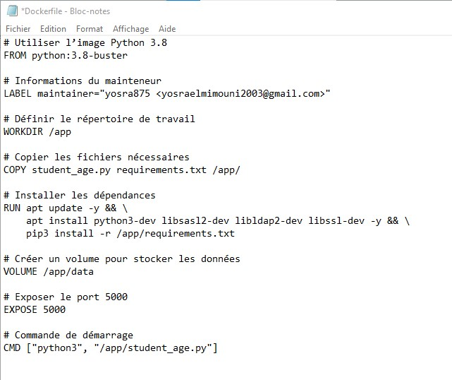
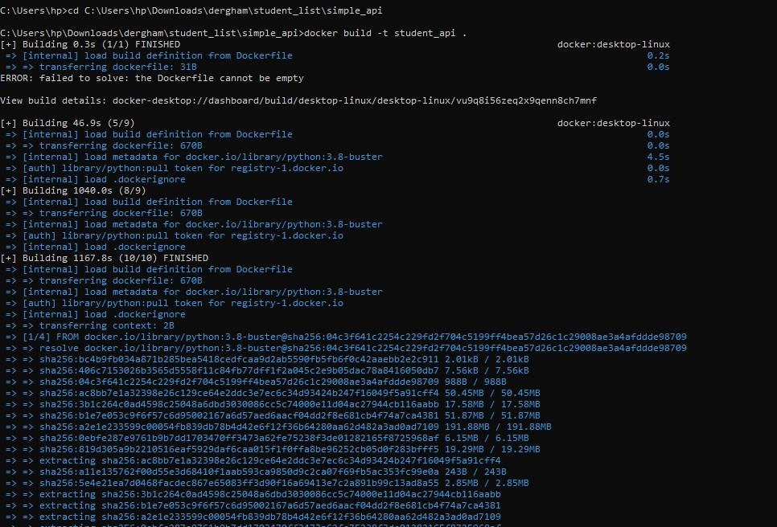
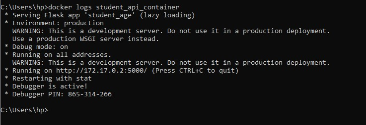
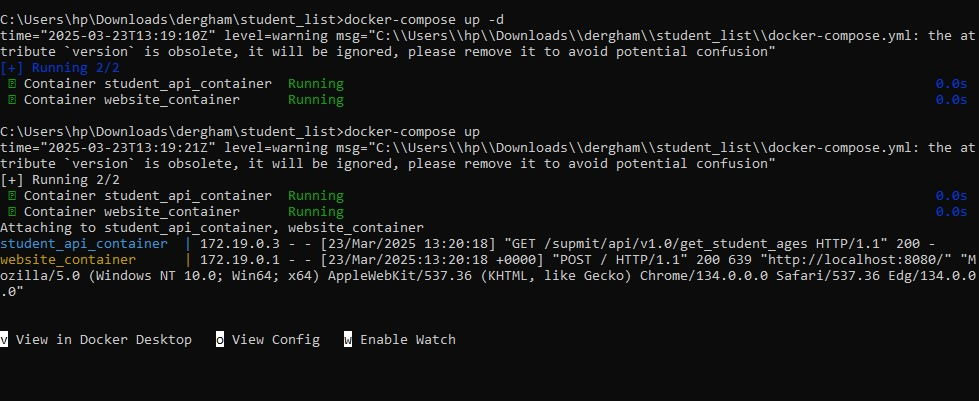
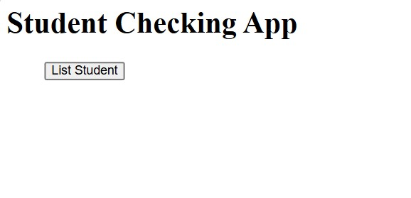
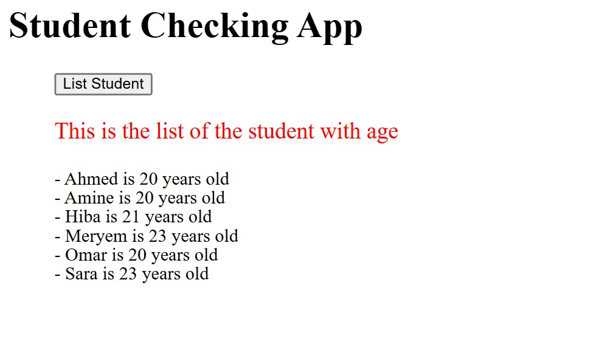
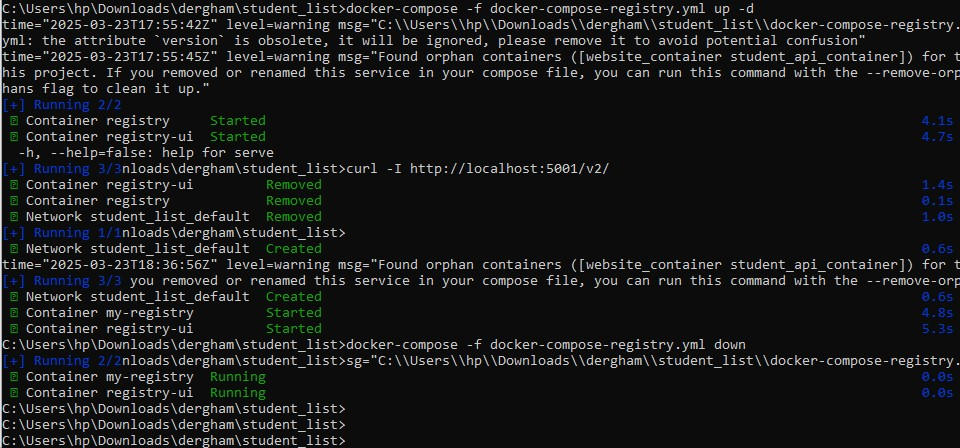
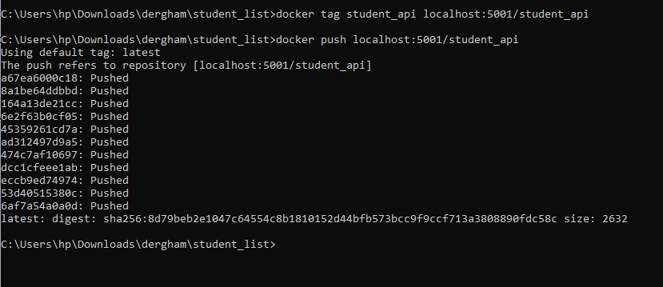

# Projet Student List - Infrastructure Docker
## Membres du groupe
- Boumour Marwa
- El mimouni Yosra 
- Imassenda Salma

## Introduction
Ce projet vise à améliorer l'infrastructure d'une application existante appelée "student_list" en utilisant Docker. L'application permet d'afficher une liste d'étudiants avec leur âge et se compose de deux modules : une API REST en Python et une interface web en PHP.

## Objectifs
- Améliorer le processus de déploiement de l'application
- Gérer les versions de l'infrastructure
- Adopter les meilleures pratiques pour une infrastructure Docker
- Mettre en place une Infrastructure as Code (IaC)

## Structure du projet
Le projet est organisé avec les fichiers suivants :
- `Dockerfile` : Pour construire l'image de l'API Python
- `docker-compose.yml` : Pour orchestrer le déploiement des services (API et site web)
- `docker-compose-registry.yml` : Pour déployer un registre Docker privé
- `student_age.py` : Code source de l'API REST
- `requirements.txt` : Dépendances Python pour l'API
- `student_age.json` : Données des étudiants au format JSON
- `website/index.php` : Interface web pour interagir avec l'API

## 1. Construction de l'API

### Description du Dockerfile
Le Dockerfile pour l'API a été créé avec les spécifications suivantes :
- Image de base : `python:3.8-buster`
- Informations du mainteneur incluses
- Installation des prérequis pour Flask et autres dépendances
- Création d'un volume pour la persistance des données
- Exposition du port 5000 pour l'API
- Configuration de la commande de démarrage



### Construction de l'image Docker de l'API

```bash
DOCKER BUILD -t submit api
```


ET le resultat dans dockker desktop : 


Exécution du conteneur avec montage du fichier JSON

ET le resultat dans dockker desktop : 


Après avoir construit l'image, j'ai testé l'API avec la commande suivante :
```bash
curl -u root:root -X GET http://localhost:5000/supmit/api/v1.0/g
```


## 2. Infrastructure as Code

### Configuration Docker Compose
J'ai créé un fichier `docker-compose.yml` pour orchestrer les deux services :

```yaml
version: '3.8'
services:
  api:
    image: student_api  # Nom de l'image que vous avez construite précédemment pour l'API
    container_name: student_api_container
    volumes:
      - ./simple_api/student_age.json:/data/student_age.json
    ports:
      - "5000:5000"  # Exposer le port 5000 de l'API
    networks:
      - student_network  # Utilisation d'un réseau spécifique pour l'application
    environment:
      - FLASK_APP=student_age
      - FLASK_ENV=development
    restart: always
  website:
    image: php:apache  # Utilisation de l'image php:apache pour l'interface utilisateur
    container_name: website_container
    environment:
      - USERNAME=root
      - PASSWORD=root
    volumes:
      - ./website:/var/www/html  # Lier le répertoire 'website' local au répertoire '/var/www/html' dans le conteneur
    depends_on:
      - api  # L'API doit démarrer avant le site web
    ports:
      - "8080:80"  # Exposer le port 80 du site web sur le port 8080 de l'hôte
    networks:
      - student_network  # Utiliser le même réseau que l'API
    restart: always
networks:
  student_network:  # Définir un réseau spécifique pour le projet
    driver: bridge
```

### Déploiement et test
Après avoir configuré le fichier Docker Compose, j'ai lancé les services :
```bash
docker-compose up -d
```


J'ai ensuite accédé à l'interface web sur http://localhost:8080 et testé la fonctionnalité "List Student".




## 3. Registre Docker privé

Pour déployer un registre Docker privé, j'ai créé un fichier `docker-compose-registry.yml` :

```yaml
version: '3'
services:
  registry:
    image: registry:2
    container_name: my-registry
    ports:
      - "5001:5000"  # On expose 5001 en dehors du conteneur mais il reste 5000 à l'intérieur
      - "5001:5000"
    volumes:
      - ./data:/var/lib/registry
    environment:
      REGISTRY_HTTP_HEADERS: |
        Access-Control-Allow-Origin: ['http://localhost:8081']
        Access-Control-Allow-Methods: ['HEAD', 'GET', 'OPTIONS']
        Access-Control-Allow-Headers: ['Authorization']
    restart: always

  registry-ui:
    image: joxit/docker-registry-ui:latest
    container_name: registry-ui
    ports:
      - "8081:80"
    environment:
      - REGISTRY_TITLE=Mon Docker Registry
      - REGISTRY_URL=http://localhost:5001  # Mise à jour du port ici
      - REGISTRY_URL=http://localhost:5001
      - SINGLE_REGISTRY=true
    depends_on:
      - registry
    restart: always
```

### Push de l'image vers le registre privé
commande pour démarrer un Docker Registry : 
```bash
docker run -d -p 5000:5001 --name registry -v C:\Users\hp\Downloads\dergham\student_list:/var/lib/registry registry:2
```


commande utilise Docker Compose pour démarrer les services définis dans le fichier docker-compose-registry.yml
```bash
docker-compose -f docker-compose-registry.yml up -d
```



J'ai poussé l'image de l'API vers le registre privé :
```bash
docker tag student_api localhost:5001/student_api:latest
docker push localhost:5001/student_api:latest
```




## Conclusion
Cette implémentation permet de déployer l'application "student_list" de manière évolutive et automatisée grâce à Docker. L'utilisation de Docker Compose facilite la gestion des différents services et assure leur interaction correcte. Le registre privé permet de stocker et de gérer les versions des images Docker.

## Améliorations possibles
- Mise en place d'un service de monitoring
- Configuration HTTPS pour les communications entre services
- Automatisation du déploiement via CI/CD
